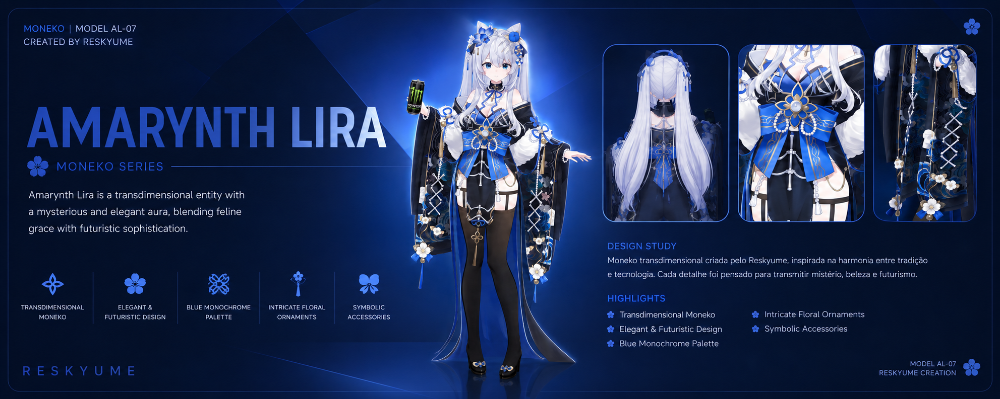
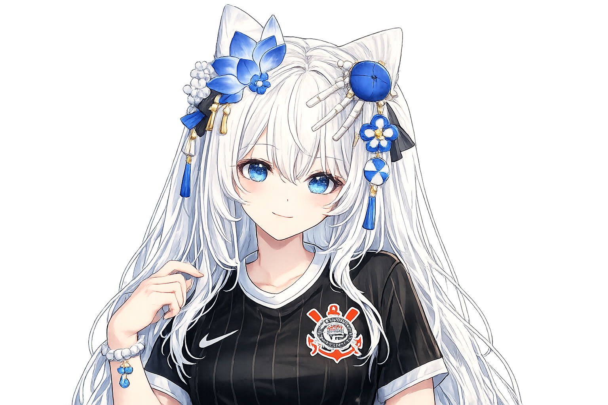
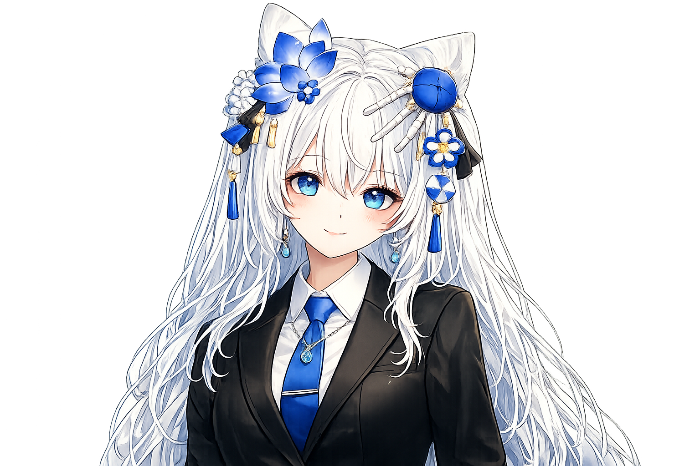
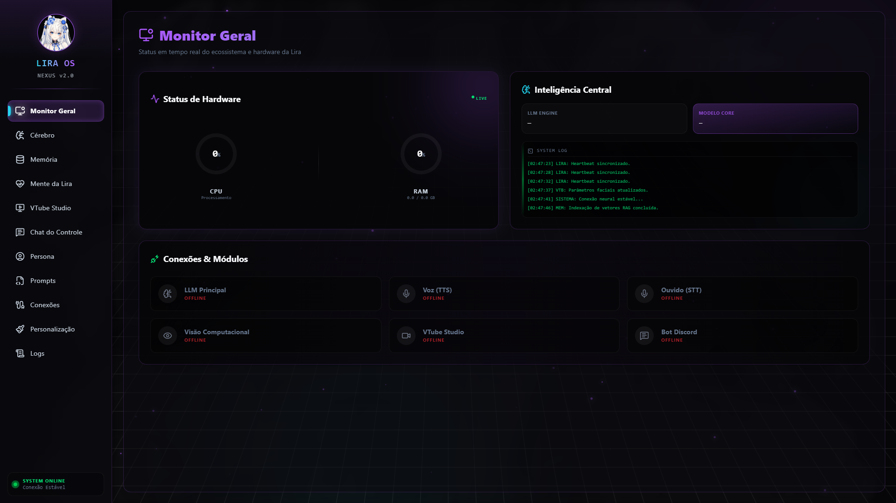
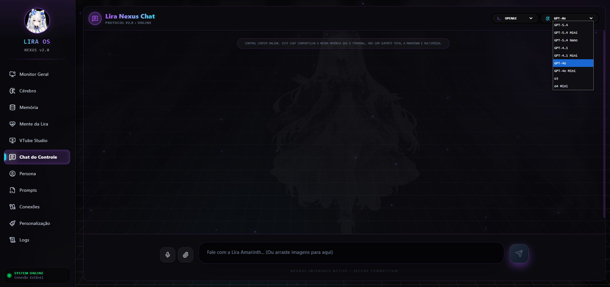
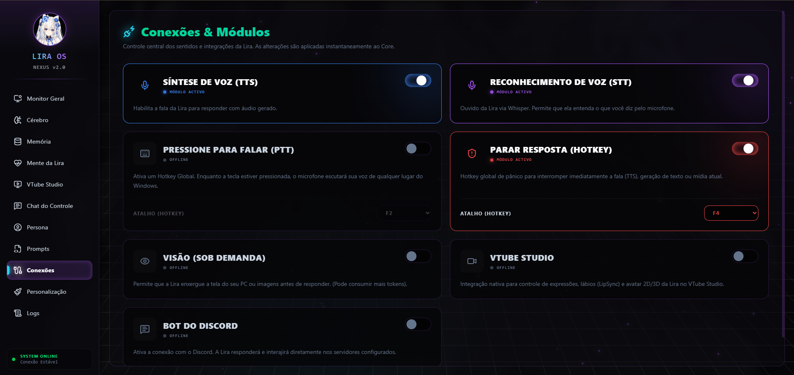
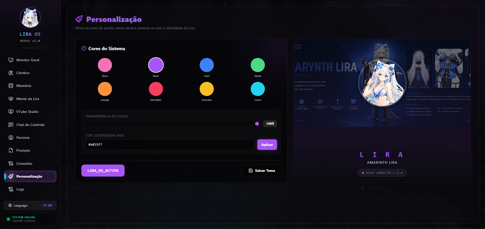
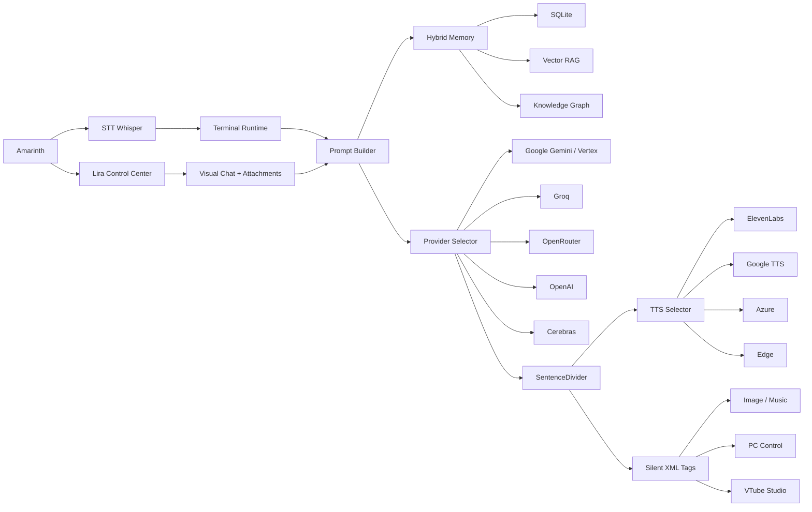
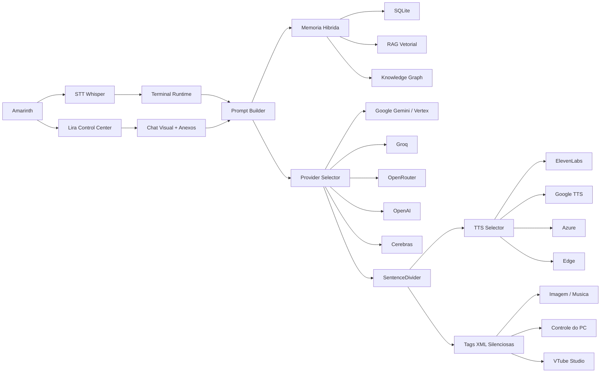

<div align="center">
  

  <h1>AmarinthLira-VTuber-OSS</h1>
  <p>
    <strong>Desktop-first VTuber assistant with voice, memory, GUI, XML tools, media generation, and Live2D integration.</strong>
  </p>

  <p>
    
    
    
    
  </p>

  <p>
    🇺🇸 <a href="#english">English</a> · 🇧🇷 <a href="#português-br">Português (BR)</a>
  </p>
</div>

---

<h2 id="english">🇺🇸 English</h2>

## Overview

**Lira AM Amarinth** is a VTuber assistant designed to run on the Windows desktop, converse via voice, remember context, control local tools, and function as a living character around your PC.

The project is more than just a chatbot: it combines a voice runtime, a GUI panel, hybrid memory, image/music generation, file analysis, PC control via XML tags, VTube Studio integration, and multiple LLM/TTS providers.

> The terminal is the "live" mode: short, speakable, and TTS-economical responses.
> The GUI is the "full chat" mode: longer responses, attachments, markdown, and inline media.

---

## Lira's Showcase

<table>
  <tr>
    <td align="center" width="25%">
      <br>
      <sub><b>Full Body</b></sub>
    </td>
    <td align="center" width="25%">
      <br>
      <sub><b>Corinthians Jersey</b></sub>
    </td>
    <td align="center" width="25%">
      <br>
      <sub><b>Formal Wear</b></sub>
    </td>
    <td align="center" width="25%">
      <br>
      <sub><b>Beach Outfit</b></sub>
    </td>
  </tr>
</table>

---

## System Dashboard

<table>
  <tr>
    <td align="center" width="50%">
      <br>
      <sub><b>Control Center</b></sub>
    </td>
    <td align="center" width="50%">
      <br>
      <sub><b>Visual Chat</b></sub>
    </td>
  </tr>
  <tr>
    <td align="center" width="50%">
      <br>
      <sub><b>Tools & Settings</b></sub>
    </td>
    <td align="center" width="50%">
      <br>
      <sub><b>Personalization & UI</b></sub>
    </td>
  </tr>
</table>

---

## Features

| Area | Capabilities |
| --- | --- |
| Voice | STT via Whisper, TTS via ElevenLabs, Google, Azure, OpenAI and Edge, global stop via F8 |
| Brain | Providers `google_cloud`, `groq`, `openrouter`, `openai` and `cerebras` |
| GUI | Control Center in CustomTkinter, visual chat, attachments, markdown, audio cards and media preview |
| Memory | Chronological SQLite, Vector RAG and Knowledge Graph |
| Media | Image generation/editing, music generation, video/attachment analysis and local history |
| Desktop | XML tools to open URLs, open apps, read files, move mouse, type, control volume and processes |
| VTuber | VTube Studio integration, emotions, parameters, lipsync and persisted state |

---

## Two Modes, Two Contracts

### Terminal Runtime

Main file: [`main.py`](main.py)

The terminal is Lira's actual voice mode. It listens to the microphone, builds context, calls the LLM in streaming mode, filters out silent tags, and speaks the response via TTS.

**Terminal rule:** responses are short by default to avoid long speech and unnecessary TTS costs.

### Lira Control Center

Main file: [`src/gui/lira_gui.py`](src/gui/lira_gui.py)

The GUI is the complete control panel. It accepts large texts, attachments, drag and drop, `Ctrl+V`, code files, images, audio, video, PDF, and documents.

**GUI rule:** it can provide larger responses when it makes sense, as it acts as a visual chat.

---

## Architecture



---

## Silent XML Tags

Lira can say one thing to the user and execute another in the background, without leaking the command to the TTS.

```xml
<salvar_memoria>Amarinth prefers short answers in the terminal.</salvar_memoria>
<gerar_imagem>anime portrait of Lira with golden hair and white flowers</gerar_imagem>
<gerar_musica>soft dreamy lofi song for sleeping</gerar_musica>
<acao_pc>{"action":"open_url","url":"https://github.com"}</acao_pc>
```

Important rules:
- XML tags only apply to the current request;
- Past actions should not be repeated after a long pause;
- `run_command` and dangerous operations go through guardrails;
- Text inside the tags must not be spoken by the TTS.

---

## Voice and TTS

Current fallback chain:
```text
edge -> elevenlabs -> google -> azure -> openai
```

The `F8` hotkey triggers a global stop to attempt to halt:
- Terminal speech;
- GUI chat speech;
- Audio previews;
- Music or playback started by Lira.

---

## Memory

Lira's memory uses three layers:

| Layer | Function |
| --- | --- |
| SQLite | Recent chronological history |
| RAG | Semantic search for old conversations |
| Knowledge Graph | Permanent facts and relationships |

The terminal also receives temporal context: if too much time has passed since the last speech, Lira treats the new message as a new context and avoids continuing old tasks automatically.

---

## Roadmap

Lira's development is organized into phases focusing on fluidity, immersion, and computer vision:

### 📌 Phase 1: Stability and QoL (Quality of Life)
- [ ] Implement Visual Media Queue in the GUI.
- [ ] Add an image and music history panel in the GUI.
- [ ] Clean up and refine Lira's prompts and *persona*.
- [ ] Fix any encoding *edge-cases* (e.g., SQLite ChromaDB).

### 📌 Phase 2: Immersion and Voice
- [ ] Integrate **Silero VAD** for natural voice interruption.
- [ ] **Audio Streaming** (Chunking) for TTS, reducing speech *delay*.
- [ ] Create a **Mini Player** mode (Floating overlay on Windows screen).

### 📌 Phase 3: Agency and Vision
- [ ] Visual Memory Editor in the Control Center.
- [ ] Basic **Screen Awareness** using interval screenshots + Vision API.
- [ ] Supervised autonomous actions (Lira suggests actions based on the screen).

### 📌 Phase 4: Community and External Integration
- [ ] Approval Pipeline for social networks and emails.
- [ ] Extended support for other software besides VTube Studio (e.g., Warudo).
- [ ] Packaging into a portable `.exe`.

---

<br><br><br>

<h2 id="português-br">🇧🇷 Português (BR)</h2>

## Visão Geral

**Lira AM Amarinth** e uma assistente VTuber feita para rodar no desktop do Windows, conversar por voz, lembrar contexto, controlar ferramentas locais e funcionar como uma personagem viva em volta do seu PC.

O projeto nao e so um chatbot: ele combina runtime de voz, painel GUI, memoria hibrida, geracao de imagem/musica, analise de arquivos, controle do PC por tags XML, VTube Studio e multiplos providers de LLM/TTS.

> O terminal e o modo "ao vivo": respostas curtas, falaveis e economicas para TTS.
> A GUI e o modo "chat completo": respostas maiores, anexos, markdown, arquivos e midia inline.

---

## Showcase Da Lira

<table>
  <tr>
    <td align="center" width="25%">
      <br>
      <sub><b>Corpo Inteiro</b></sub>
    </td>
    <td align="center" width="25%">
      <br>
      <sub><b>Camisa do Timão</b></sub>
    </td>
    <td align="center" width="25%">
      <br>
      <sub><b>Roupa Social</b></sub>
    </td>
    <td align="center" width="25%">
      <br>
      <sub><b>Visual Praia</b></sub>
    </td>
  </tr>
</table>

---

## Dashboard do Sistema

<table>
  <tr>
    <td align="center" width="50%">
      <br>
      <sub><b>Control Center</b></sub>
    </td>
    <td align="center" width="50%">
      <br>
      <sub><b>Chat Visual</b></sub>
    </td>
  </tr>
  <tr>
    <td align="center" width="50%">
      <br>
      <sub><b>Ferramentas & Configs</b></sub>
    </td>
    <td align="center" width="50%">
      <br>
      <sub><b>Personalização e Cores</b></sub>
    </td>
  </tr>
</table>

---

## O Que Ela Faz

| Area | Recursos |
| --- | --- |
| Voz | STT por Whisper, TTS por ElevenLabs, Google, Azure, OpenAI e Edge, stop global por F8 |
| Cerebro | Providers `google_cloud`, `groq`, `openrouter`, `openai` e `cerebras` |
| GUI | Control Center em CustomTkinter, chat visual, anexos, markdown, cards de audio e preview de midia |
| Memoria | SQLite cronologico, RAG vetorial e grafo de conhecimento |
| Midia | Geracao/edicao de imagem, geracao de musica, analise de video/anexos e historico local |
| Desktop | Tool XML para abrir URL, abrir app, ler arquivo, mover mouse, digitar, volume e processos |
| VTuber | Integracao com VTube Studio, emocoes, parametros, lipsync e estado persistido |

---

## Dois Modos, Dois Contratos

### Terminal Runtime

Arquivo principal: [`main.py`](main.py)

O terminal e o modo de voz real da Lira. Ele escuta o microfone, monta contexto, chama o LLM em streaming, filtra tags silenciosas e fala a resposta por TTS.

**Regra do terminal:** respostas curtas por padrao para evitar fala longa e gasto desnecessario de TTS.

### Lira Control Center

Arquivo principal: [`src/gui/lira_gui.py`](src/gui/lira_gui.py)

A GUI e o painel de controle completo. Ela aceita textos grandes, anexos, drag and drop, `Ctrl+V`, arquivos de codigo, imagens, audio, video, PDF e documentos.

**Regra da GUI:** pode responder grande quando fizer sentido, porque funciona como chat visual.

---

## Arquitetura



---

## Tags XML Silenciosas

A Lira pode falar uma coisa para o usuario e executar outra por baixo, sem vazar comando no TTS.

```xml
<salvar_memoria>O Amarinth prefere respostas curtas no terminal.</salvar_memoria>
<gerar_imagem>anime portrait of Lira with golden hair and white flowers</gerar_imagem>
<gerar_musica>soft dreamy lofi song for sleeping</gerar_musica>
<acao_pc>{"action":"open_url","url":"https://github.com"}</acao_pc>
```

Regras importantes:

- tags XML so valem para o pedido atual;
- acoes antigas nao devem ser repetidas depois de pausa longa;
- `run_command` e operacoes perigosas passam por guardrails;
- o texto dentro das tags nao deve ser falado pelo TTS.

---

## Voz E TTS

Fallback atual:

```text
edge -> elevenlabs -> google -> azure -> openai
```

ElevenLabs suporta configuracao manual pela GUI:

- `voice_id`
- `model_id`
- `rate`
- `stability`
- `similarity_boost`
- `style`
- `speaker_boost`

O hotkey `F8` usa stop global para tentar parar:

- fala do terminal;
- fala do chat da GUI;
- preview de audio;
- musica ou playback iniciado pela Lira.

---

## Memoria

A memoria da Lira usa tres camadas:

| Camada | Funcao |
| --- | --- |
| SQLite | historico cronologico recente |
| RAG | busca semantica por conversas antigas |
| Knowledge Graph | fatos permanentes e relacionamentos |

O terminal tambem recebe contexto temporal: se passou muito tempo desde a ultima fala, a Lira trata a nova mensagem como novo contexto e evita continuar tarefas antigas automaticamente.

---

## Instalacao

### 1. Clone

```bash
git clone https://github.com/AmarinthIA/AmarinthLira-VTuber-OSS.git
cd AmarinthLira-VTuber-OSS
```

### 2. Ambiente virtual

```bash
python -m venv .venv
.venv\Scripts\activate
```

### 3. Dependencias

```bash
pip install -r requirements.txt
```

Dependencias opcionais:

```bash
pip install pyvts pypdf PyPDF2 youtube-transcript-api
```

---

## Variaveis De Ambiente

Guia completo: [`docs/INSTALL.md`](docs/INSTALL.md)

Copie:

```bash
copy .env.example .env
```

Exemplo:

```env
GROQ_API_KEY=sua_chave
GEMINI_API_KEY=sua_chave
OPENROUTER_API_KEY=sua_chave
OPENAI_API_KEY=sua_chave
CEREBRAS_API_KEY=sua_chave
ELEVENLABS_API_KEY=sua_chave
TAVILY_API_KEY=sua_chave
GOOGLE_CLOUD_PROJECT=seu_projeto
GOOGLE_CLOUD_LOCATION=global
```

Nunca commite seu `.env`.

Para o setup minimo, apenas `GROQ_API_KEY` e obrigatoria. O TTS publico default e `edge`, sem chave.

---

## Como Rodar

### Terminal runtime

```bash
python main.py
```

### Control Center

```bash
python -m src.gui.lira_gui
```

### GUI sem terminal visivel

```bash
cscript //nologo run_lira_gui_hidden.vbs
```

---

## Configuracao Principal

Arquivo: [`src/config/config.json`](src/config/config.json)

No clone publico, os defaults ficam em [`src/config/config.example.json`](src/config/config.example.json). O arquivo `src/config/config.json` e local e ignorado pelo Git.

Guias detalhados: [`docs/CONFIG.md`](docs/CONFIG.md), [`docs/PROVIDERS.md`](docs/PROVIDERS.md), [`docs/TROUBLESHOOTING.md`](docs/TROUBLESHOOTING.md)

Blocos importantes:

```json
{
  "LLM_PROVIDER": "groq",
  "TTS_PROVIDER": "edge",
  "CHAT": {
    "LLM_PROVIDER": "groq",
    "response_mode": "adaptive",
    "auto_route_media": true
  },
  "GUI": {
    "stop_hotkey_enabled": true,
    "stop_hotkey": "F8"
  }
}
```

---

## Providers

| Provider | Uso |
| --- | --- |
| `google_cloud` | Gemini API, Vertex AI, visao e midia |
| `groq` | respostas rapidas e modelos open |
| `openrouter` | acesso a varios modelos por gateway |
| `openai` | modelos OpenAI diretos |
| `cerebras` | inferencia rapida quando configurado |

O provider Google trabalha em modo:

- `gemini_api`
- `vertex_ai`
- `auto`

---

## VTube Studio

A integracao fica em [`src/modules/vts_controller.py`](src/modules/vts_controller.py).

Ela inclui:

- autenticacao por token;
- heartbeat;
- reconexao;
- leitura de hotkeys;
- expressoes;
- parametros;
- tentativa de lipsync;
- estado salvo em [`data/vts_state.json`](data/vts_state.json).

---

## Lira Inbox

Pasta padrao:

```text
%USERPROFILE%\Desktop\lira_inbox
```

Estrutura:

```text
lira_inbox/
  imagem/
  pdf/
  docs/
  code/
  audio/
  video/
```

A GUI tambem aceita arrastar arquivos direto no chat, entao a inbox e util, mas nao obrigatoria.

---

## Comandos Uteis

```bash
python main.py
python -m src.gui.lira_gui
python -m compileall main.py src
python -m pytest -q
```

---

## Roadmap

O desenvolvimento da Lira está organizado em fases para focar em fluidez, imersão e visão computacional:

### 📌 Fase 1: Estabilidade e QoL (Quality of Life)
- [ ] Implementar a Fila Visual de Mídia na GUI.
- [ ] Adicionar o painel de histórico de imagem e música na GUI.
- [ ] Limpar e refinar prompts e *persona* da Lira.
- [ ] Corrigir qualquer *edge-case* de encoding (ex: SQLite ChromaDB).

### 📌 Fase 2: Imersão e Voz
- [ ] Integrar **Silero VAD** para interrupção de voz natural.
- [ ] **Áudio Streaming** (Chunking) para TTS, reduzindo o *delay* antes da fala.
- [ ] Criar Modo **Mini Player** (Overlay flutuante na tela do Windows).

### 📌 Fase 3: Agência e Visão
- [ ] Editor de Memória Visual no Control Center.
- [ ] **Consciência de Tela (Screen Awareness)** básica usando captura de tela em intervalos + API de Visão.
- [ ] Ações autônomas supervisionadas (Lira sugere ações com base na tela).

### 📌 Fase 4: Comunidade e Integração Externa
- [ ] Pipeline de Aprovação para redes sociais e emails.
- [ ] Suporte estendido para outros softwares além do VTube Studio (ex: Warudo).
- [ ] Empacotamento em um `.exe` portátil.

---

## Status Honesto

O projeto ja e funcional, mas ainda esta em evolucao rapida.

Pontos fortes:

- desktop-first;
- GUI e terminal separados por contrato;
- memoria hibrida;
- tags XML silenciosas;
- providers multiplos;
- stop global;
- foco real em VTuber e assistente residente.

Limites atuais:

- foco principal em Windows;
- alguns providers exigem chave paga;
- Live2D depende de modelo e parametros corretos;
- algumas automacoes desktop ainda precisam de mais guardrails.

---

## Contribuicao

Contribuicoes devem preservar a separacao entre:

- terminal de voz;
- chat visual da GUI;
- memoria;
- providers;
- TTS;
- tags XML;
- controle do PC.

Se mudar comportamento de prompt, canal ou provider, atualize a documentacao junto.

---

## Licenca

Consulte a licenca do repositorio e os termos dos providers externos usados.

<div align="center">
  
</div>
